このチュートリアルでは、Windows 11 に Android SDK Manager をインストールする手順について説明する。

このチュートリアルでは Windows 11 の手順を説明するが、他のバージョンの Windows でも手順は同じである。

この手順は、Android Studio をインストールせずに Android Platform tools と SDK Manager を使用する場合に必要となる手順である。

また、Java のインストールディレクトリを指す有効な JAVA_HOME 環境変数が設定されていることを前提としている。

## ステップ 1 - SDK ツールをダウンロードする

Android Studio の Download タブを開き、 Command line tools only セクションまで下にスクロールする。

図 01: Command line tools only セクション  
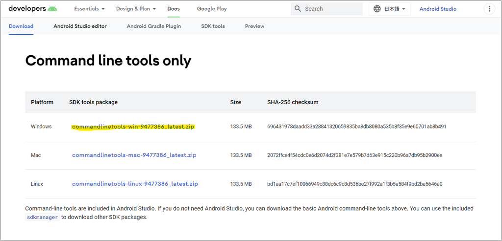

図 01 に示すように、Windows、Mac、Linux とプラットフォームごとの SDK ツールのダウンロードリンクがある。

図 01 で強調表示されている Windows のダウンロードリンクをクリックする。

図 02 に示すように、利用規約への同意を求められる。

図 02: 利用規約に同意してダウンロードを開始  


詳細を確認し、利用規約に同意し、「Download」ボタンをクリックしてダウンロードを開始する。

## ステップ 2 - コマンドラインツールをインストールする

このステップでは、 Android コマンドラインツールを Windows 11 にインストールする。

まずは任意の場所に android-sdk ディレクトリを作成する。

そこにステップ 1 でダウンロードした Zip ファイルを解凍した中身を配置する。

図 03: android-sdk ファイルを配置  
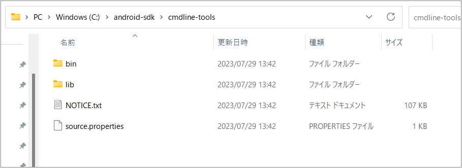

## ステップ 3 - Android SDK Platform Tools をインストールする

このステップでは、 Android SDK Platform Tools を Windows 11 にインストールする。

図 04、図 05、図 06 に示すように、Android SDK ツールと同じような手順で、ダウンロードリンクから Android SDK Platform Tools をインストールする。

Android SDK Platform Tools リリースノート：  
https://developer.android.com/studio/releases/platform-tools?hl=ja

図 04: Android SDK Platform Tools のダウンロード
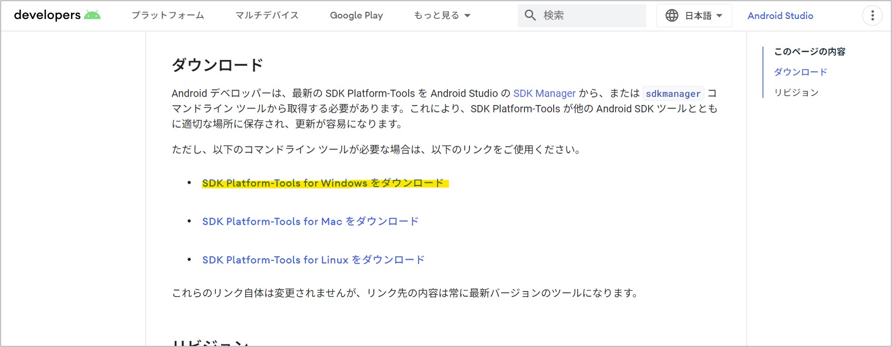

図 05: 利用規約に同意してダウンロードを開始  
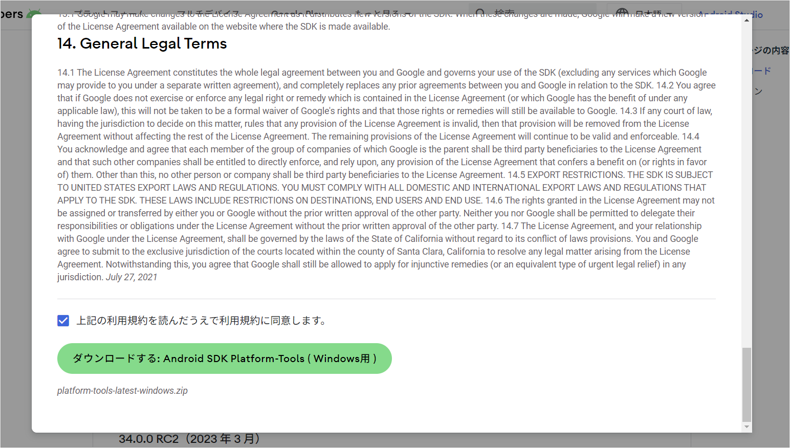

図 06: android-sdk ディレクトリに移動させる  
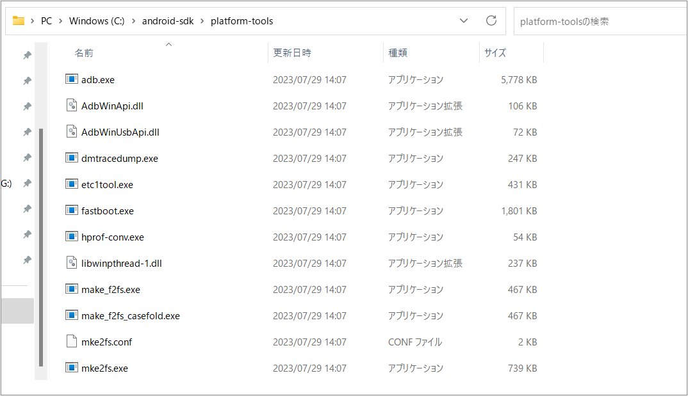

## ステップ 4 - 環境変数を構成する

Win キーを押して、「env」と入力し Enter キーを押す。

すると、図 7 に示すように、[詳細設定] タブのオプションを含む[システムのプロパティ]ダイアログが表示さる。

図 07: システムのプロパティ
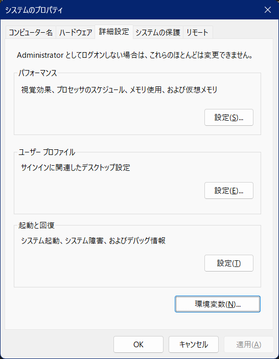

「環境変数」ボタンをクリックし、最初のセクションで「新規」ボタンをクリックする。

[変数名] フィールドを ANDROID_HOME に設定し、[変数値] を前の手順で作成したandroid-sdk ディレクトリに設定する。

同様に、環境変数 ANDROID_SDK_ROOT も android-sdk ディレクトリに設定する。

また、JAVA_HOME 環境変数が JDK インストール ディレクトリに設定されていることを確認する。

図 08: android-sdk 関連の環境変数を設定
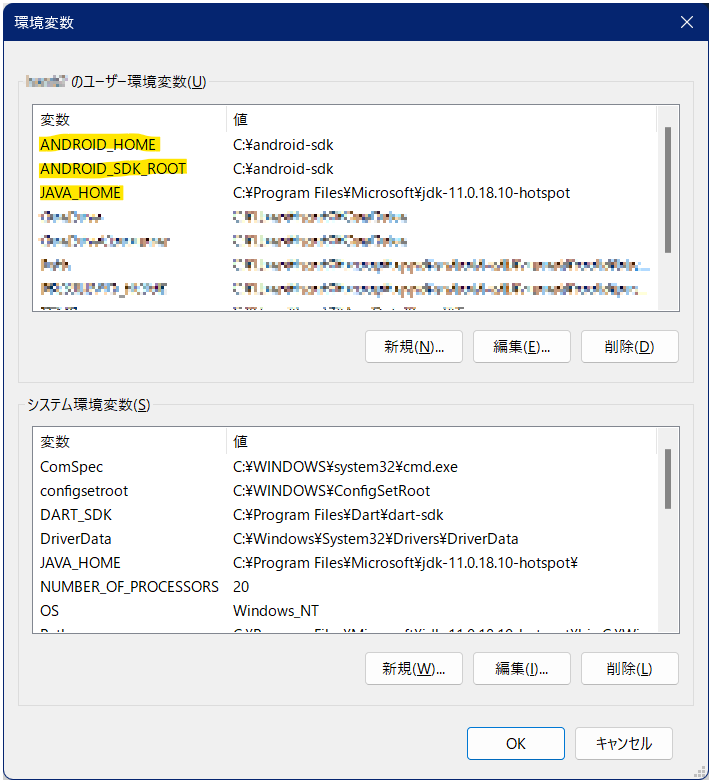

## ステップ 5 - コマンドの構成

前の手順で、コマンドラインツールとプラットフォームツールを android-sdk ディレクトリに配置している。

どちらのツールも、本来は、実行可能ファイルのある適切なディレクトリに移動して実行する必要がある。

コマンドを実行することでコマンドラインユーティリティを提供する。

図 09 に示すように、 tools、tools\bin、および platform-tools へのパスをシステムパスに追加することで、これらのディレクトリに移動しなくてもシステム レベルでこれらのコマンドを使用できるようになる。

これらの実行可能ファイルが他のコマンドを中断しないようにしてください。

これらのパスを PATH 環境変数に追加する前に、同じ名前を付けてください。

図 09: PATH 環境変数に追加
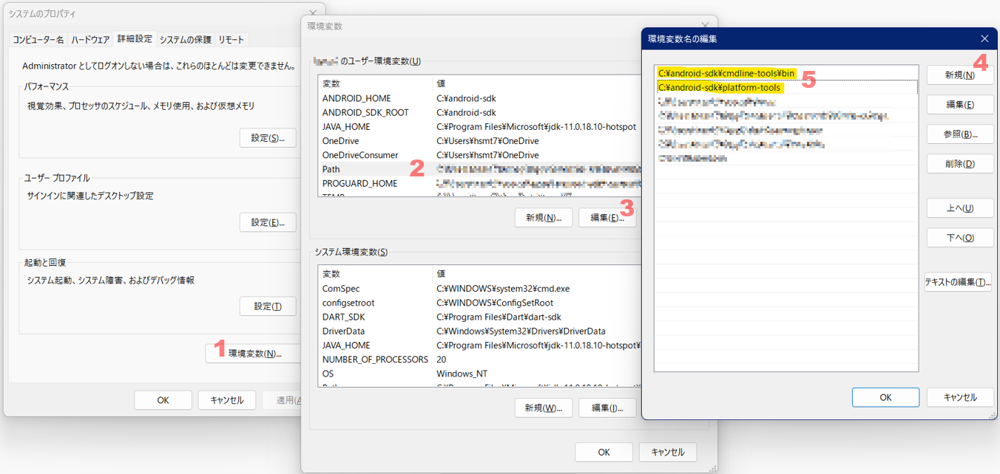

ここでコマンド プロンプトを開いて、図 10 に示すように ADB と SDK Manager のバージョンを確認します。設定した環境変数を適用するためにシステムの再起動が必要な場合があります。

adb のバージョンを確認  ：
```
adb --version
```

結果：  
```
Android Debug Bridge version 1.0.41
Version 34.0.4-10411341
Installed as C:\android-sdk\platform-tools\adb.exe
Running on Windows 10.0.22621
```

ADB コマンドが正常に動作し、バージョンの詳細が表示されることがわかる。

sdkmanager のバージョンを確認  ：
```
sdkmanager.bat --version
```

結果：  
```
Error: Could not determine SDK root.
Error: Either specify it explicitly with --sdk_root= or move this package into its expected location: <sdk>\cmdline-tools\latest\
```

しかし、sdkmanager ではエラーが表示される。

コマンド ライン ツールがバージョン固有のディレクトリにあることが想定されるためだ。

そこで、cmdline-tools ディレクトリから source.properties ファイルを開いてバージョンを確認する。

source.properties:
```
Pkg.Revision=9.0
Pkg.Path=cmdline-tools;9.0
Pkg.Desc=Android SDK Command-line Tools
```

図 10 に示すように、すべてのファイルをディレクトリ cmdline-tools/9.0 に移動させる。

図 10: すべてのファイルを cmdline-tools のバージョンディレクトリに移動させる
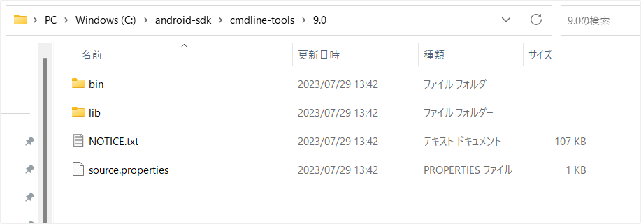

また、図 11 に示すように環境変数 Path に cmdline-tools のバージョンディレクトリ、bin ディレクトリを追加する。

図 11: バージョンディレクトリ、bin ディレクトリを追加
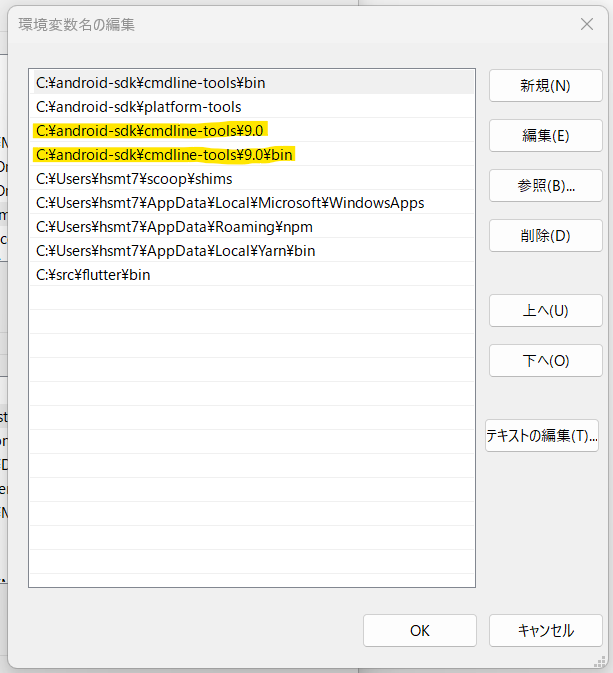

ターミナルを閉じてから開き直す。そして、図 12 に示すように、ADB と SDK Manager のバージョンを確認する。

図 12: ADB と SDK Manager のバージョンを確認
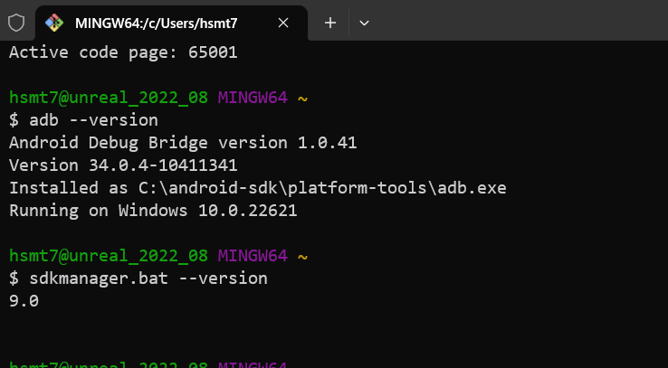

## ステップ 6 - SDK マネージャの使用

SDK マネージャで以下のようなオプションを実行することができる。

01. リスト
02. プラットフォームのインストール
03. SDKマネージャーの更新
04. システム イメージの追加
05. エミュレータのインストール
06. ビルド ツールのインストール

### 01. リスト

以下に示すように list オプションを使用して、インストール済みおよび使用可能なパッケージとイメージを出力することができる。

以下の例では、出力内容が多いので、テキストファイルに出力するようにしている。

--list オプションでパッケージを出力する：  
```
sdkmanager.bat --list > /c/Users/hsmt7/Downloads/sdkmanaget_list_2023_07_30.txt
```

出力内容例（インストール済みパッケージ）：
```
Installed packages:
  Path                 | Version | Description                       | Location            
  -------              | ------- | -------                           | -------             
  platform-tools       | 34.0.4  | Android SDK Platform-Tools 34.0.4 | platform-tools    
```

出力内容例（利用可能パッケージ）：
```
Available Packages:
  Path                                                                                     | Version      | Description 
  -------                                                                                  | -------      | ------- 
  platforms;android-33                                                                     | 2            | Android SDK Platform 33
```

### 02. プラットフォームのインストール

例として、SDK マネージャーを使用して、以下のコマンドで Android 10 (API レベル 30) をインストールしてみる。

Android 10 (API レベル 33) をインストール：
```
sdkmanager.bat "platforms;android-33"
```

図 13 に示すように、利用規約への同意を求められる。「y」を入力して Enter キーを押し、利用規約に同意する。

このコマンドは、 android-sdk 内にディレクトリ platform を作成し、 Android 10 のエミュレータを実行するために必要なすべてのファイルを含むパッケージ android-33 をインストールする。

図 13: 利用規約に同意して android-33 をインストール
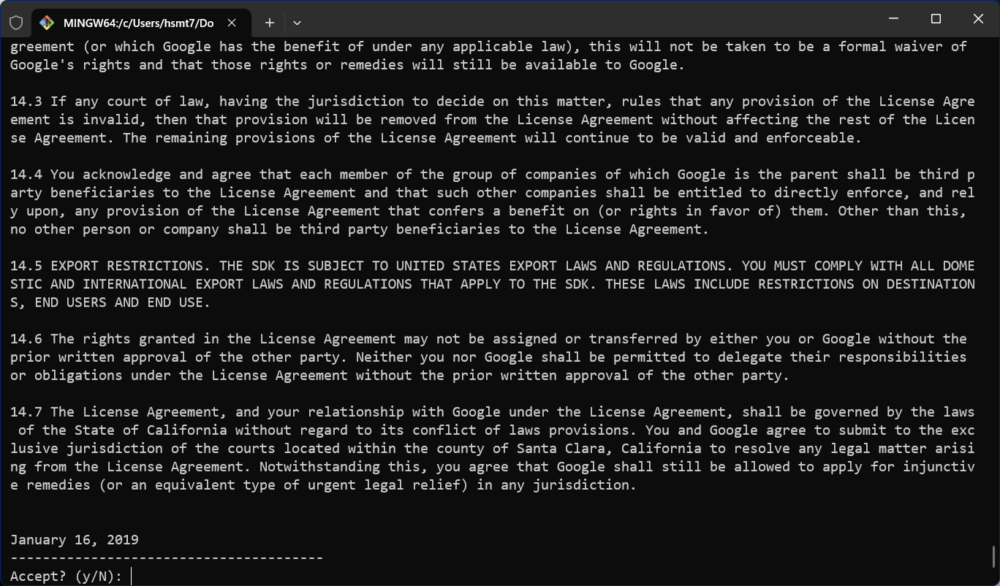

インストールされているパッケージを再度確認すると、list コマンドにより、以下に示すようにインストールされているオプションが表示される。

出力内容例（インストール済みパッケージ）：
```
Installed packages:
  Path                 | Version | Description                       | Location            
  -------              | ------- | -------                           | -------             
  platform-tools       | 34.0.4  | Android SDK Platform-Tools 34.0.4 | platform-tools      
  platforms;android-33 | 3       | Android SDK Platform 33           | platforms\android-33  
```

### 03. SDKマネージャーの更新

以下のコマンドを使用してSDKマネージャーを更新できる。

```
sdkmanager.bat --update
```

### 04. システム イメージの追加

以下に示すように、SDK マネージャーを使用して list コマンドで表示される利用可能なイメージからシステム イメージを追加できる。

例では、最新のデフォルトの 64 ビット システム イメージを追加している。

プラットフォーム android-33 のデフォルトのシステム イメージをインストール：
```
sdkmanager.bat "system-images;android-33;google_apis;x86_64"
```

使用許諾契約に同意してダウンロードを完了させる。

Google Play サービスを必要とするプロジェクトがいくつかある。その場合は、以下に示すように、Google Play サービスに固有のシステムイメージをインストールする。

Google Play サービスのシステム イメージをインストール：
```
sdkmanager.bat "system-images;android-33;google_apis_playstore;x86_64"
```

使用許諾契約に同意してダウンロードを完了させる。

### 05. エミュレータのインストール

SDK Manager を使用して AVD を作成する前にエミュレータをインストールする必要がある。

エミュレータをインストール：
```
sdkmanager.bat --channel=3 emulator
```

### 06. ビルド ツールのインストール

リストの中にあるビルドツールを指定してインストールする。

build-tools 33.0.2 をインストールする例：
```
sdkmanager.bat "build-tools;33.0.2"
```

## ステップ 7 - エミュレーターと AVD マネージャーの使用

AVD マネージャーではコマンドを使用して、以下のことができる。

01. Android エミュレータの作成
02. Android エミュレーターのリストを表示
03. エミュレータの実行
04. エミュレータの削除

### 01. Android エミュレータの作成

以下に示すように、前の手順でダウンロードしたシステムイメージを使用してエミュレータを作成する。<emulator name> は任意の名前に置き換える。

エミュレータ作成コマンドの形式：
```
# デフォルトのシステム イメージを使用してエミュレータを作成
avdmanager.bat create avd -n <emulator name> -k "system-images;android-33;google_apis;x86_64" -g "google_apis"
```

作成例：
```
avdmanager.bat create avd -n emulator33 -k "system-images;android-33;google_apis;x86_64" -g "google_apis"
```

エミュレータ作成コマンドの形式：
```
# Google Play サービスのシステム イメージを使用してエミュレータを作成
avdmanager.bat create avd -n <emulator name> -k "system-images;android-33;google_apis_playstore; x86_64" 
```

作成例：
```
avdmanager.bat create avd -n emulator33ps -k "system-images;android-33;google_apis_playstore;x86_64"
```

カスタム ハードウェア プロファイル オプションを選択した場合、上記のコマンドは AVD を構成するために多くの質問をする。これらのオプションの詳細は実際のニーズに依存するため、このチュートリアルからは除外している。すべての構成が完了すると、構成中に指定された名前を使用して AVD が作成される。

同様に、以下に示すように古いバージョンの AVD をインストールすることもできる。

作成例：
```
avdmanager.bat create avd -n emulator29 -k "system-images;android-29;default;x86_64" -g "default"
```

### 02. Android エミュレーターのリストを表示

次に、コマンド ラインで tools ディレクトリに移動し、インストールされているプラ​​ットフォームを確認する。

まずは、図 14 に示すように、環境パスにエミュレータを追加する。

図 14: 環境パスにエミュレータを追加
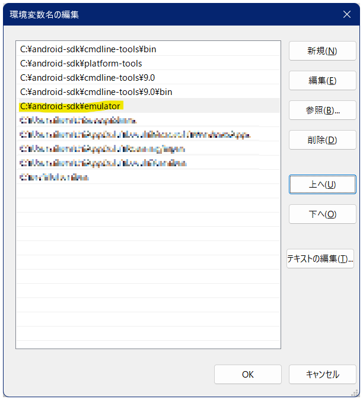

ターミナルを閉じて再度開き、前の手順で作成した AVD を確認する。

作成済みのエミュレータを確認：
```
emulator -list-avds
```

コマンドの実行結果例：
```
$ emulator -list-avds
default28
emulator30
emulator30ps
```

### 03. エミュレータの実行

以下に示すように、作成したエミュレータを実行することができる。


エミュレータ実行コマンドの形式：
```
emulator -avd <emulator name>
```

実行例：
```
emulator -avd emulator30
```

エミュレータが AVD を完全に起動するまでにはしばらく時間が掛かる。最終結果は図 15 のようになる。

図 15: Android エミュレータを起動
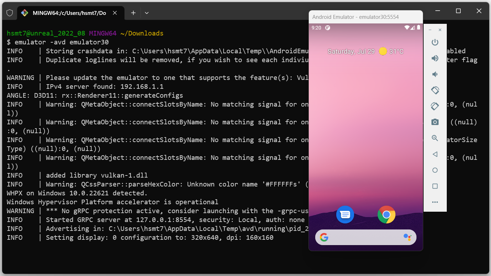

### 04. エミュレータの削除

以下に示すように、既存のエミュレータを削除することもできる。

```
avdmanager.bat delete avd -n <emulator name>
```

## まとめ

このチュートリアルでは、Android プラットフォーム ツールと Android SDK Manager を Windows 11 にインストールする手順を説明した。

また、エミュレータを使用して AVD を作成および起動するために必要な手順も説明した。
